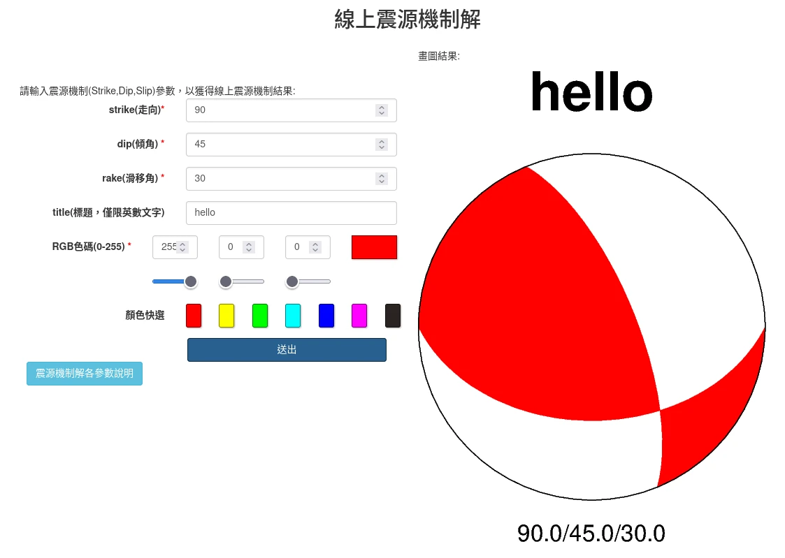

# Simple Focal Mechanism Generator based on PyGMT



- Demo web page: <https://beachball.clam.moe>
- Based on previous work: <https://github.com/sean0921/workshop_demo_20210805>
- Idea: <http://qcntw.earth.sinica.edu.tw/beachball/>

## Requirements
- Python 3.8 ~ 3.10
- Generic Mapping Tools (GMT, >= 6.3.0)
- Pipenv 2021.11.23
- PyGMT 0.5.0
- Flask 2.0.2

## Create Virtual Environment
- `make init`

## Run the Web Application
- `make run`

## Test the Web Application
- Linux / WSLg: `bash local_gui_test.bash` (based on a `curl` command)

## Method
- **URL**: POST `/simplemeca`
- **Header**:
    | Key | Value | Required |
    | ----| ------| -------- |
    | Content-Type | application/json | **`Required`** |

- **Body Json Parameters**: (*All Required*)
    - **strike**<br>
      `float`
    - **dip**<br>
      `float`
    - **rake**<br>
      `float`
    - **color_r**<br>
      `float`<br>
      R in RGB colors
    - **color_g**<br>
      `float`<br>
      G in RGB colors
    - **color_b**<br>
      `float`<br>
      B in RGB colors
    - **title**<br>
      `string`
- **Response**
```javascript
{'image_url': 'http://127.0.0.1:5000/static/<uuid-4-format>.png'}
```

## Examples
- `example_payload.json`

## TODO
- Support arguments of moment tensor decompositions:
```bash
#X Y depth mrr mtt mff mrt mrf mtf exp newX newY title
gmt meca -Rg -JN15c -Sm2c -png << EOF
-176.96 -29.25 47.8 7.680 0.090 -7.770 1.390 4.520 -3.260 26 0 0 title
EOF
```
- [support Chinese](https://docs.gmt-china.org/6.0/chinese/linux/)

## Known Issues
- Ghostscript does not support webp output, so only consider png or jpg format.
- GMT 5/6 (PyGMT) realtime performance is worser than legacy GMT 4.x: <https://github.com/GenericMappingTools/gmt/issues/587>

## Credit
- Beachball Frontend: [IES, Academia Sinica](https://www.earth.sinica.edu.tw/)

## Resources
- [PyGMT documentation](https://www.pygmt.org/latest/)
- [GMT documentation](https://docs.generic-mapping-tools.org/)
- [GMT 中文手冊](https://docs.gmt-china.org)
